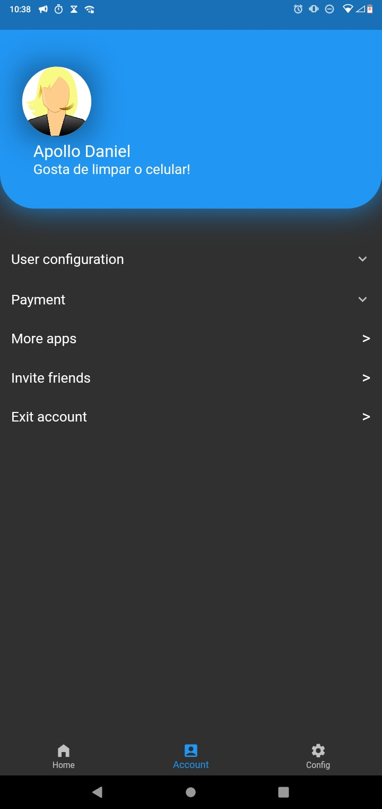

# Projeto Webdesign

Projeto de webdesign para IF Baiano Campus Guanambi!

## Sobre

Este projeto foi desenvolvido por uma equipe de 3 integrantes de estudantes do IF Baiano Campus Guanambi.

O que foi implementado:

- Design de tela de login
- Design geral de telas do aplicativo
- Funções extra, como de compartilhamento de aplicativo.
- Tela de apresentação dos integrantes, com contato dos mesmos.
- E alternancia entre tema escuro e claro.

O aplicativo foi desenvolvido por Apollo, sob a licensa Apache 2.0.

## Telas
### Tela de login

### Área de limpeza

### Área de configuração

### Sobre nós (About Us)

### Tela de compartilhamento de aplicativo

## Como instalar

O aplicativo está disponível apenas para Android e está dividido em 3 versões base:

- Para arquitetura android ARM: [projeto_webdesign-arm.apk](resources/builds/projeto_webdesign-arm.apk)
- Para arquitetura android ARM64: [projeto_webdesign-arm64.apk](resources/builds/projeto_webdesign-arm64.apk)
- Para arquitetura android X64: [projeto_webdesign-x64.apk](resources/builds/projeto_webdesign-x64.apk)

### Passo a pass
#### Passo 1

Clique em instalar quando executar o arquivo APK
#### Passo 2

Clique em instalar assim mesmo e prossiga
#### Passo 3

Aqui fica a seu critério, pode enviar ou não.
